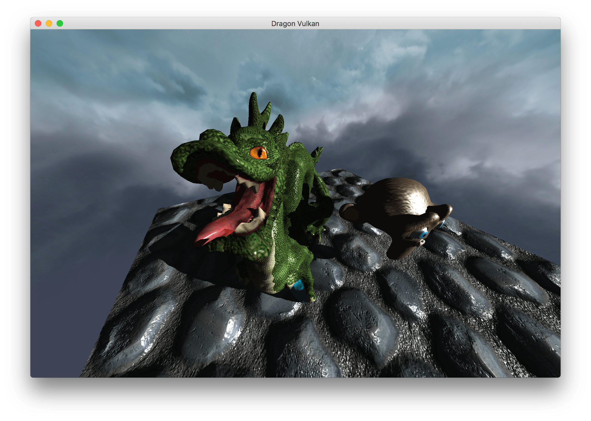
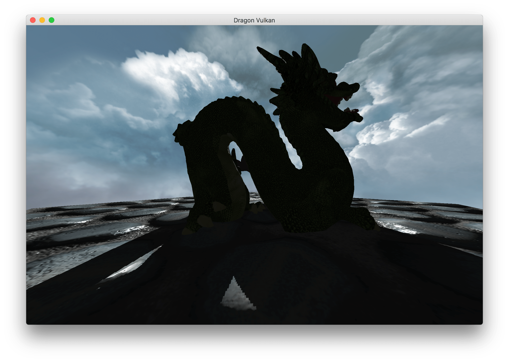
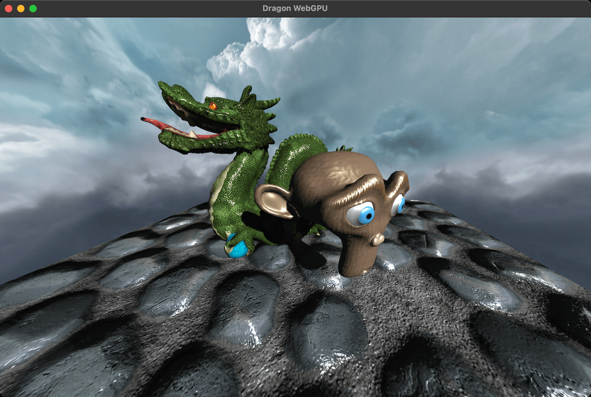
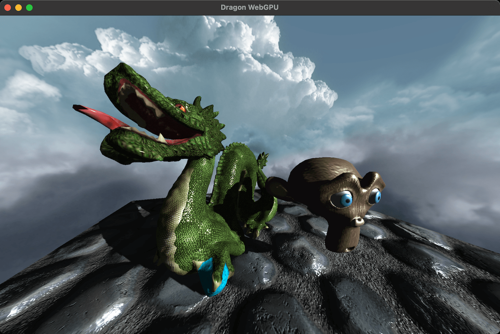
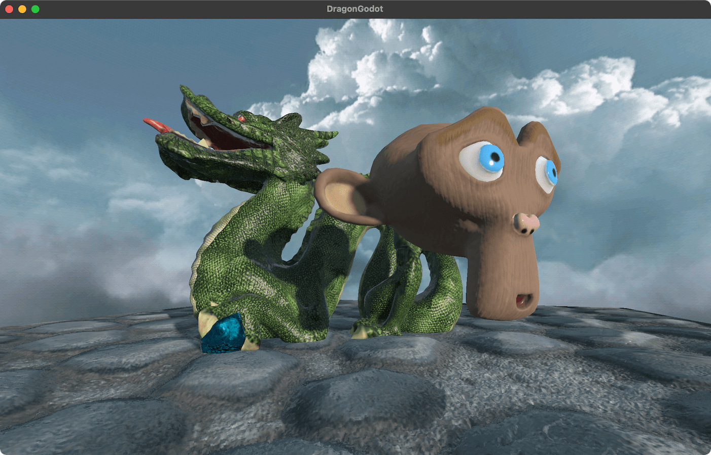
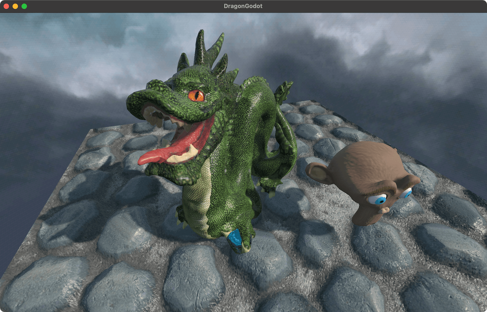
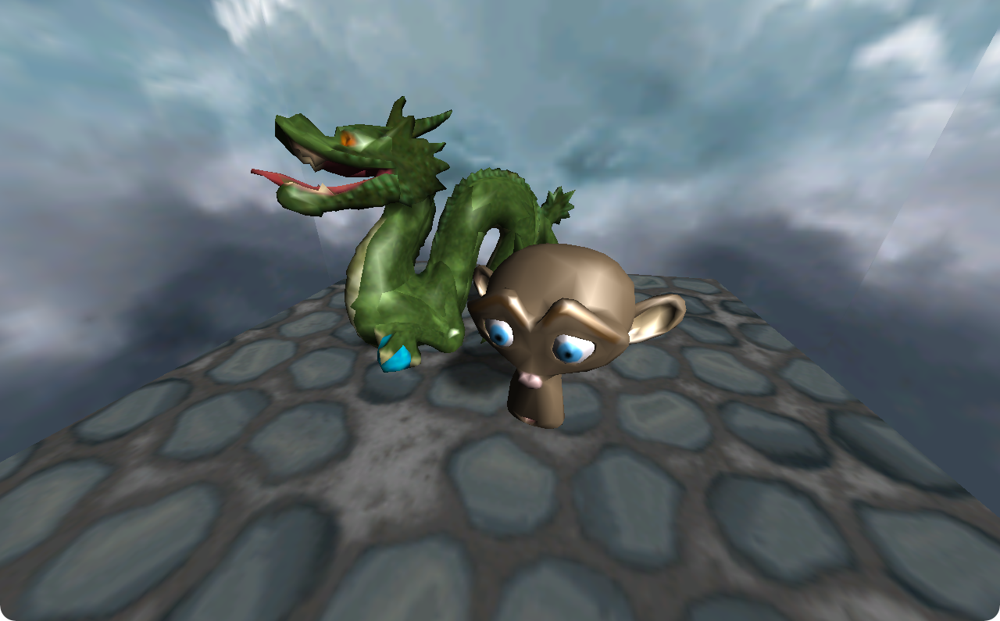
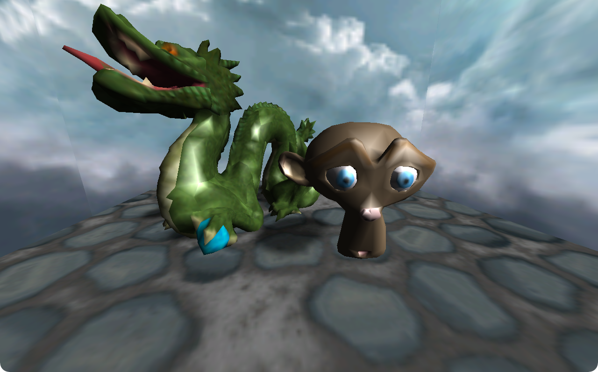

# Gallery

## OpenGL

## WebGL

## Vulkan

## WebGPU

## Metal

## SceneKit

## Godot

## Unity

## Blender Cycles

## GLSL (Shader only)

## Ptah (custom rasterizer)

## Nintendo DS

## Nintendo Game Boy Advance

## PlayStation 2

## Glide

## PICO-8

## Vectrex

