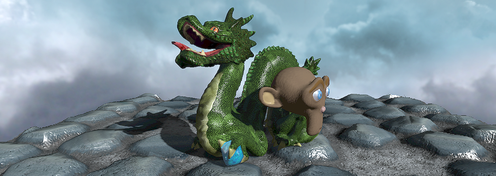

#Here be dragons

> Hic sunt dracones.

This repository contains multiple implementations of the same 3D scene, using different APIs and frameworks on various platforms. The goal is to provide a comparison between multiple rendering methods. This is inherently biased due to the variety of algorithms used and available CPU/GPU configurations, but can hopefully still provide interesting insights on 3D rendering.

The following versions are currently available:

- [OpenGL](https://github.com/kosua20/GL_Template/tree/3de4e116cdd24df300fda42326a7a4e431f7f861) ([readme below](#opengl) )
- [WebGL](https://github.com/kosua20/herebedragons/tree/master/webgl)
- [SceneKit](https://github.com/kosua20/herebedragons/tree/master/scenekit)
- [Unity](https://github.com/kosua20/herebedragons/tree/master/unity)
- [Blender Cycles](https://github.com/kosua20/herebedragons/tree/master/cycles)
- [Nintendo DS](https://github.com/kosua20/herebedragons/tree/master/nds)
- [Ptah](https://github.com/kosua20/herebedragons/tree/master/ptah) (a custom real-time renderer, see [the Github page](https://github.com/kosua20/PtahRenderer/))

The following versions are planned:

- Metal
- Vulkan
- PlayStation 2

In the directory of each version, one can find the source code, the corresponding ressources (as each method has its own format/quality constraints), along with a readme describing the method and a few examples. The only exception is the OpenGL project, which is described below.

##Ressources
The scene is composed of four main elements:

- a plane representing the ground, with a pavement texture.
- a dragon (the Stanford dragon).
- a monkey head ('Suzanne') rotating around its vertical axis.
- a skybox surrounding the scene, textured with a cloudy sky.

Additionally, the sun is simulated by using a directional light, and the camera should be able to rotate around the scene.
The initial 3D models and textures are contained in the OpenGL `ressources` [directory](https://github.com/kosua20/GL_Template/tree/3de4e116cdd24df300fda42326a7a4e431f7f861/ressources).

##OpenGL
The OpenGL version (available [here](https://github.com/kosua20/GL_Template/tree/3de4e116cdd24df300fda42326a7a4e431f7f861)) is the initial reference version. It is based on the OpenGL 3 features set, with the programmable pipeline, and use glfw3 for accessing the windowing system, user inputs,... It should be compatible with macOS, Windows and Ubuntu.

The following features are implemented:
- meshes and textures loading
- Phong shading/ per-pixel lighting
- Normal and specular mapping
- Skybox
- Environment cubemap for reflections
- Keyboard-controlled camera
- Variance shadow mapping
- Parallax mapping
- FXAA anti-aliasing
- Custom internal rendering resolution

The program is part of a more general tutorial project, available at [GL\_Template](https://github.com/kosua20/GL_Template) (might evolve with time).

