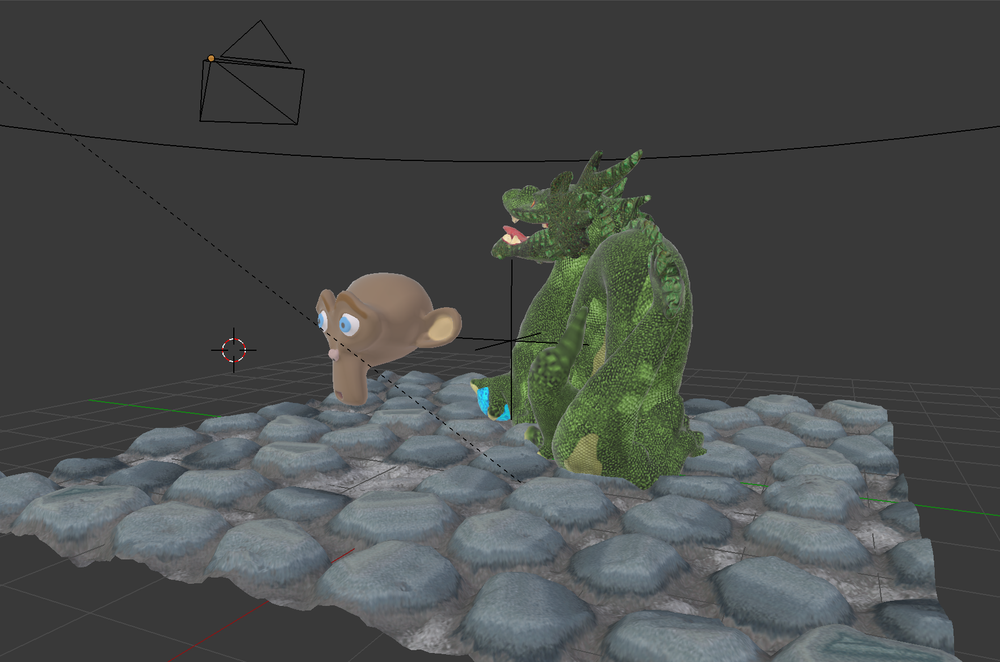

##Blender version

Cyles is an offline rendering engine included in the Blender 3D editor. It performs path-tracing, simulating the light rays and their paths in the scene. This type of techniques is computationally expensive, and is mainly used in offline rendering. This simulation is physically accurate, and doesn't require any additional tricks for shadows rendering, camera focus, ambient occlusion, reflections,...

Parallax mapping is replaced by displacement mapping, where the plane is modeled as a dense grid of triangles, and the height map is applied directly on those vertices to displace them.

*In the Blender editor.*

