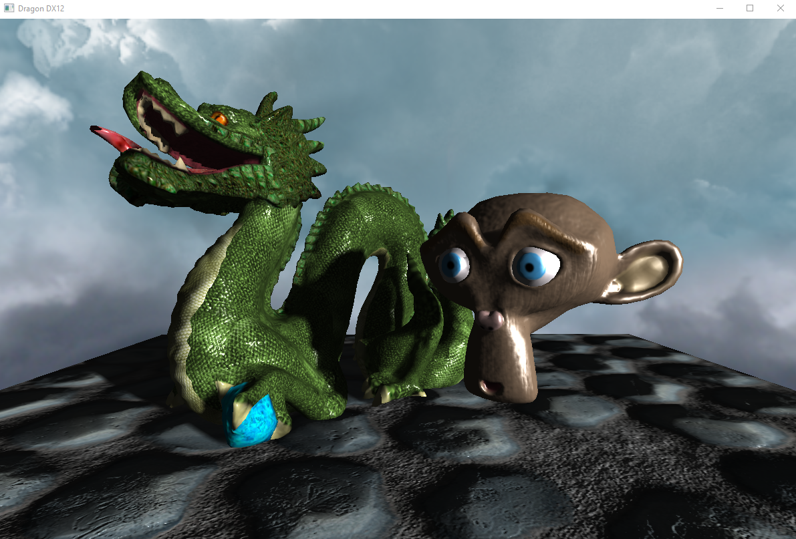
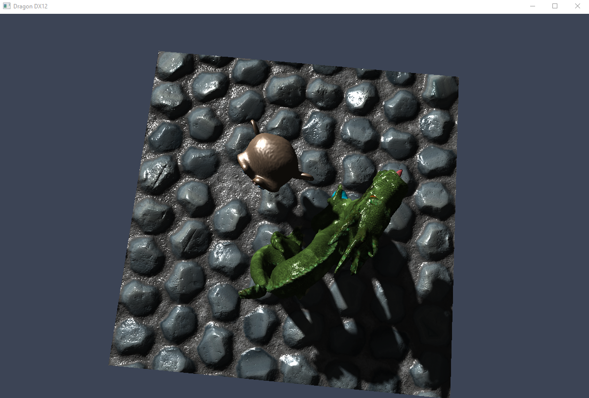
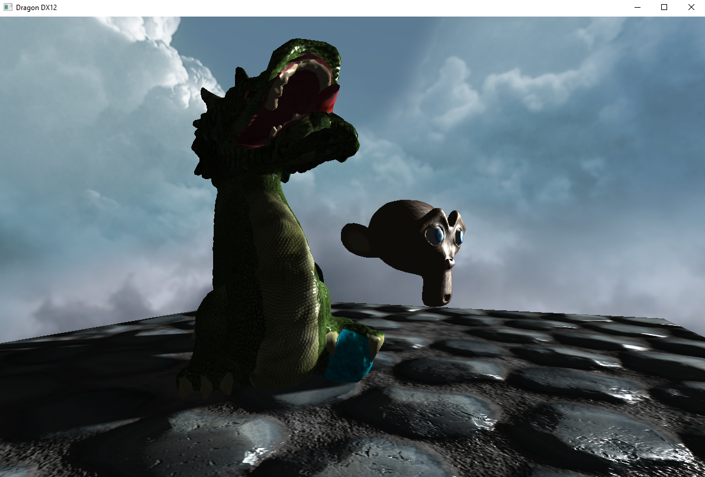

## DirectX 12 version

This is the DX12 version. Compared to its predecessor it provides a lower-level API, similarly to Vulkan. Draw calls and other operations are recorded in command lists submitted to dedicated GPU queues. Pipeline state objects aggregate most of the previously free state for rasterization, blending, depth testing, etc. Textures and buffers are passed to shaders through descriptors laid out by the application in GPU memory according to a root signature. Depending on how they are used, resources and rendertargets have to be transitioned using barriers.

