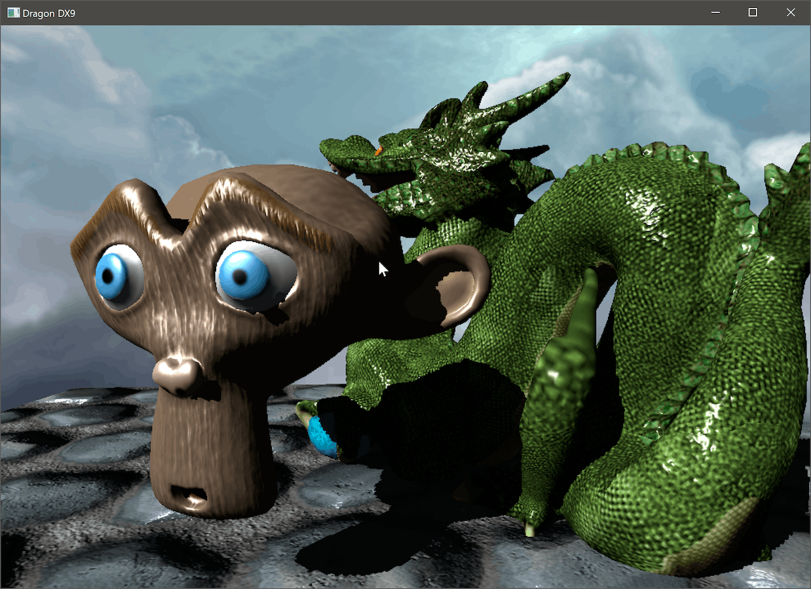
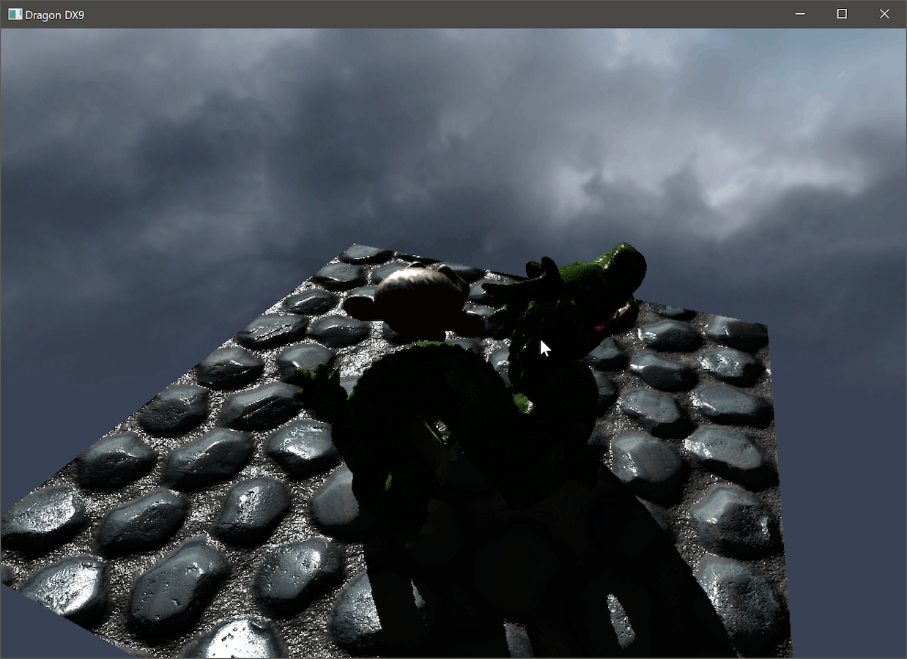

## DirectX 9 version

DirectX was introduced by Microsoft in the 90s as a framework for games and multimedia applications on Windows. Direct3D is one of its library, specializing in displaying 2D and 3D geometry with the help of the GPU. It has strongly evolved over the years, becoming available on Xbox along the way. This demo targets the DX9.0c version, released in 2004 (the last supported by Windows XP). DX9 provides support for both a fixed rasterization and lighting pipeline, and a more modern (for the time) programmable pipe ; this demo uses the latter. It has support for basic vertex and pixel shaders, cubemaps and offscreen rendering (here used for shadow mapping). Shaders are compiled ahead of time in Visual Studio. The API is quite compact and easy to use compared to more recent APIs, or even compared to older OpenGL.

The DirectX 9 SDK is not fully supported on Windows anymore, but Microsoft provides a [NuGet package](https://www.nuget.org/packages/Microsoft.DXSDK.D3DX) to target DX9 and its helper libraries on Windows 7 and higher.

