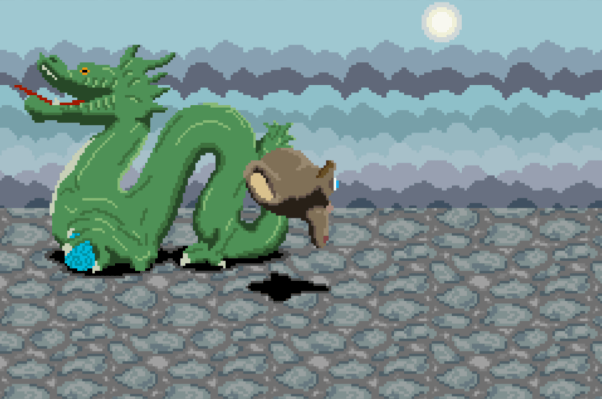

## Game Boy Advance version

The Game Boy Advance is a limited but interesting platform. Only a few games (such as Doom) implemented real 3D rendering on it, while most games were 2D based, using tricks to simulate perspective (parallax, mode 7,...).   
I picked the latter option, creating 2D sprites for the monkey (8 sprites for the cyclic animation), the dragon (split in 4 sprites because of its size on screen) and the sun ; the floor and sky are backgrounds made of small repeating tiles. All tiles were pixel-painted in Photoshop, using screenshots of the full OpenGL renders and textures as reference.   
The user can move with the directional pad, and reset the camera position by pressing the A button. To give an impression of perspective, sprites and backgrounds are moving at different speeds.

GBA programming mainly consist in managing various parts of the RAM, for storing sprites, tiles, colour palettes and maps, and setting up and reading the right flags at specific memory adresses.
For compilation and linking, the [devkitpro](https://devkitpro.org) ARM toolchain is used, and the libgba headers provide helpers for types, registers and flags.

