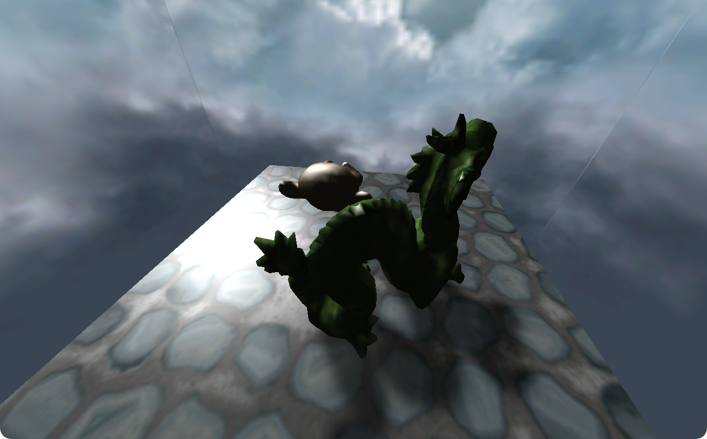

## Glide version

This version is targeting the Glide API, designed to control 3DFX graphic adapters (such as the Voodoo 1 and the Banshee) under DOS.

The [DJGPP toolchain](https://github.com/andrewwutw/build-djgpp) is used to compile C to the DOS target. The Glide 'driver' is also compiled using the same toolchain from the sources [released online](http://glide.sourceforge.net) and adjusted for compilation with DJGPP by SuperIlu ([repository](https://github.com/SuperIlu/glide)). The version included in the repository is targeting the Voodoo 1 specifically. Documentation for the Glide API can be found on [3dfxarchive.com](https://3dfxarchive.com/reference.htm). For testing, the Voodoo Graphics was emulated using [DOSBox-X](https://dosbox-x.com). 

Vertex transformation and shading is performed on the CPU. Clipping is also performed manually, generating triangle strip lists that are then sent to the graphics adapter. Textures are limited to a 256px resolution, and stored in the RGB565 format ; mipmaps are not used for now. Inputs are handled using a custom interrupt.

