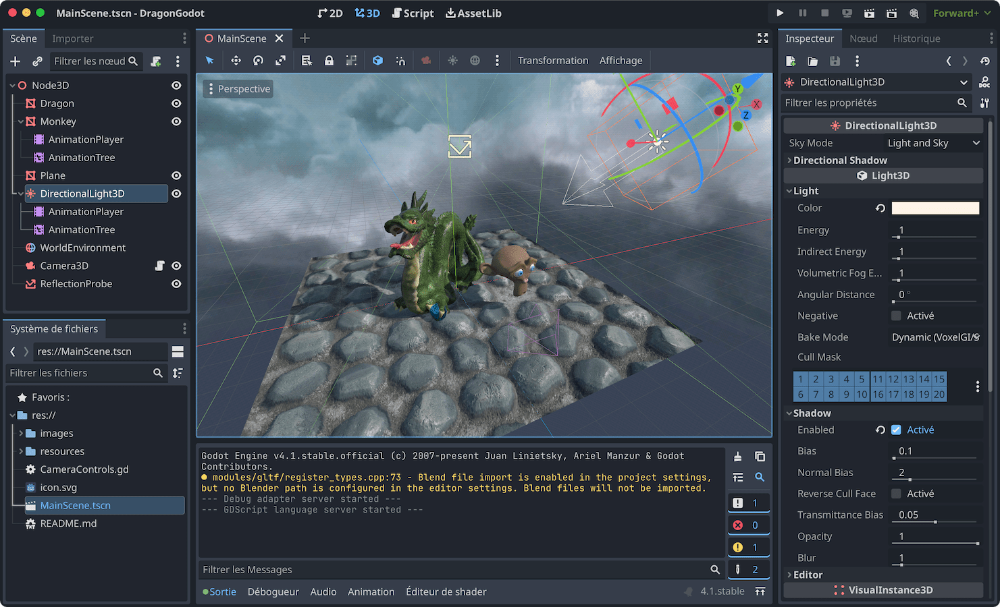
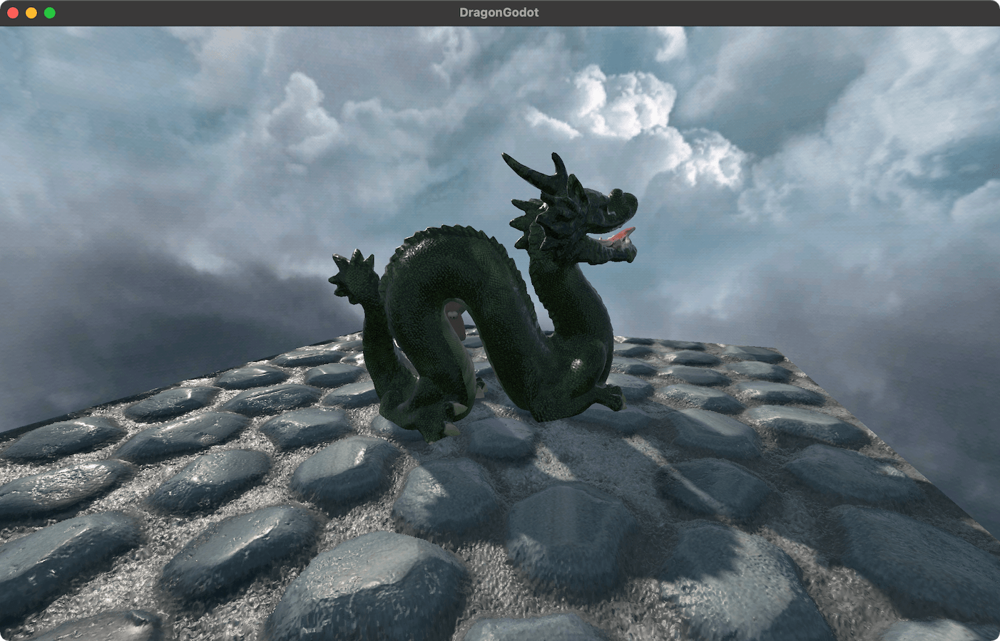

## Godot version

The Godot version was entirely created in the Godot 4.1 editor, for assets placement, materials setup, environment configuration, animations,... The only code required was for implementing a basic turntable camera, which relies on the input action system to adapt to the keyboard locale and support controllers. 

Objects use PBR material maps (albedo, normal, roughness/metalness/ambient occlusion). The ground additionally enables parallax mapping, similar to the OpenGL version. The directional light relies on a cascaded shadow map, and a reflection probe is generated when loading the scene. The environment is an equirectangular skybox.

*In the Godot editor.*

