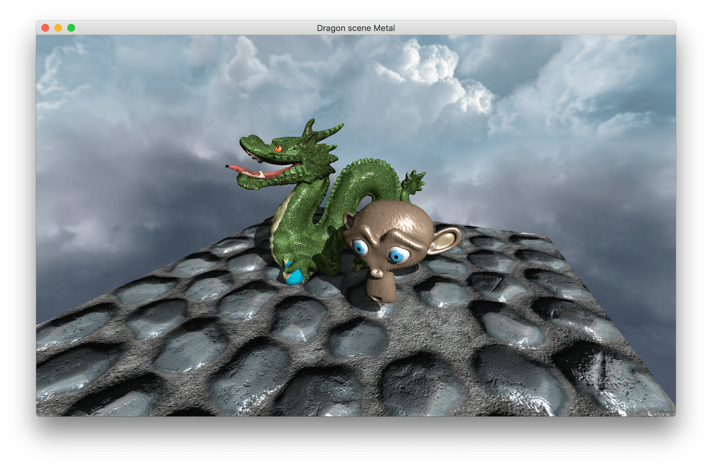
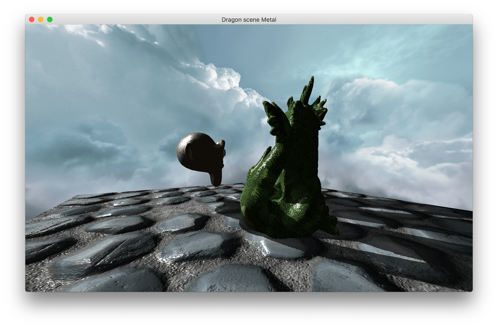
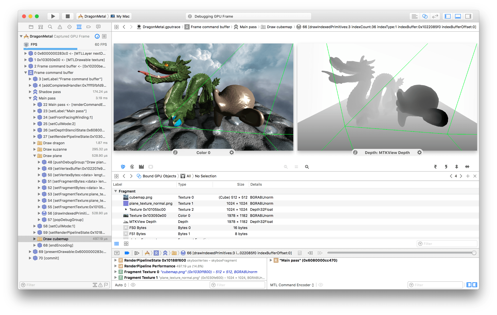

## Metal version

Metal is a graphics API developed by Apple for the iOS and macOS platforms. It provides an object-oriented access to the GPU in an asynchronous way. Validation is performed ahead of execution, accumulating rendering commands in a buffer, which allows for concatenations, simplifications and reordering of commands. 

Shaders are written in a subset of C++ with an additional library providing shader-specific functions. They are compiled at the same time as the CPU code. Documentation can be found on the Apple Developer site and in WWDC videos.

*Visualizing the rendering passes and the data on the GPU with the Xcode graphics debugger.*

