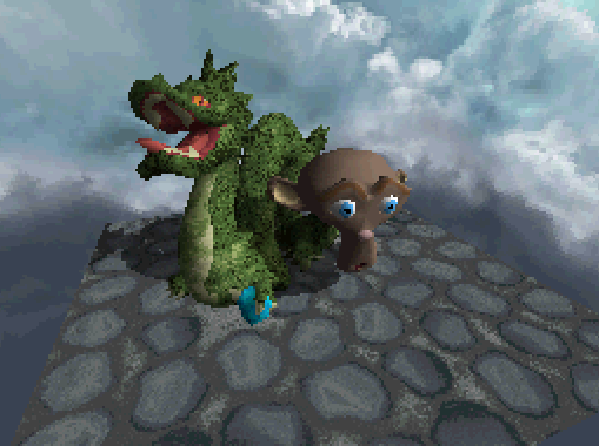
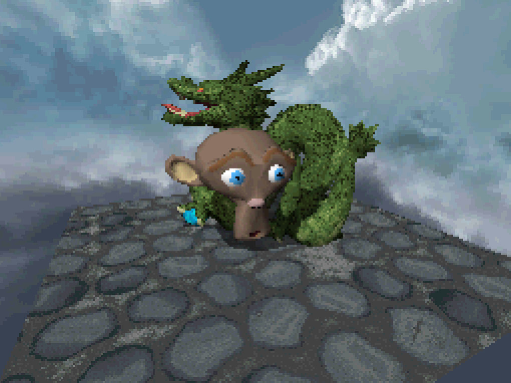
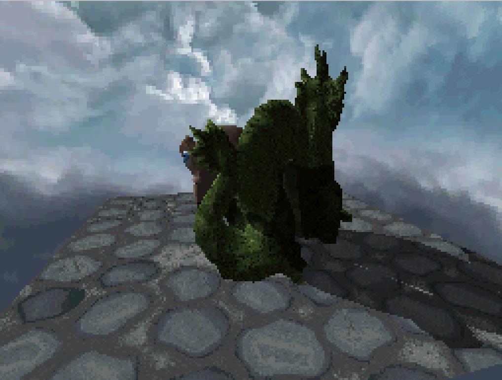

##Nintendo DS version

Due to the limitations of the Nintendo DS platform, this version is extremely simplified. 
Using devkitARM and libnds, it is possible to command the Nintendo DS GPU using a series of pseudo fixed-pipeline OpenGL functions. 
To avoid creating and managing a filesystem for ressource files, all data (textures and models) is directly included in the binary executable, as multiple arrays stored in headers.

The meshes are thus directly converted to lists of rendering commands. The whole lists are passed at once to the GPU for rendering.

The texture are palettized, to be able to fit in one of the VRAM banks (4MB shared between ~9 banks of fixed size (some are designed for texture color indices, other for the corresponding palettes). Using 16 colors textures (or lower) and taking into account the low resolution of the screen allow us to fit reasonable size pictures in memory.

Directional lighting is performed by the hardware. Shadow mapping is replaced by a basic implementation of shadow volumes, using a simple stencil buffer provided by the API. Because of the low-power ARM CPU, they can't be computed in real-time. For the static dragon, a shadow volume was handcrafted in Blender ; for the moving monkey head, we cheat by using a duplicated and translated version of the mesh to intersect the plane and thus generate the shadow mask.

My progress and experimentations can be seen [here](http://imgur.com/a/XQCEJ).

