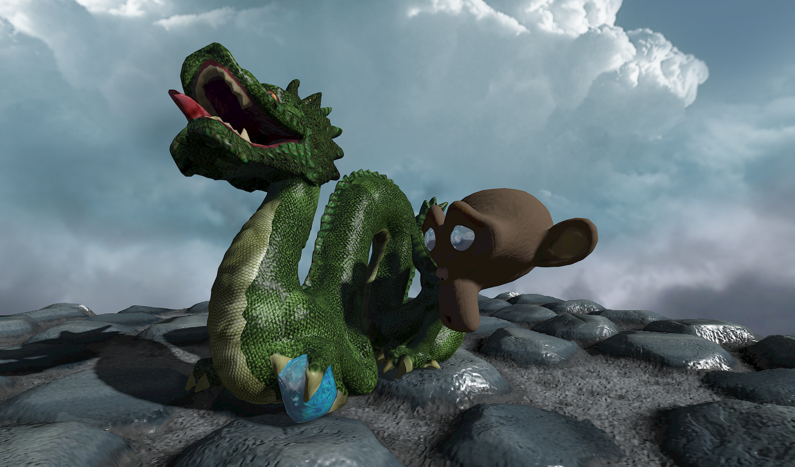
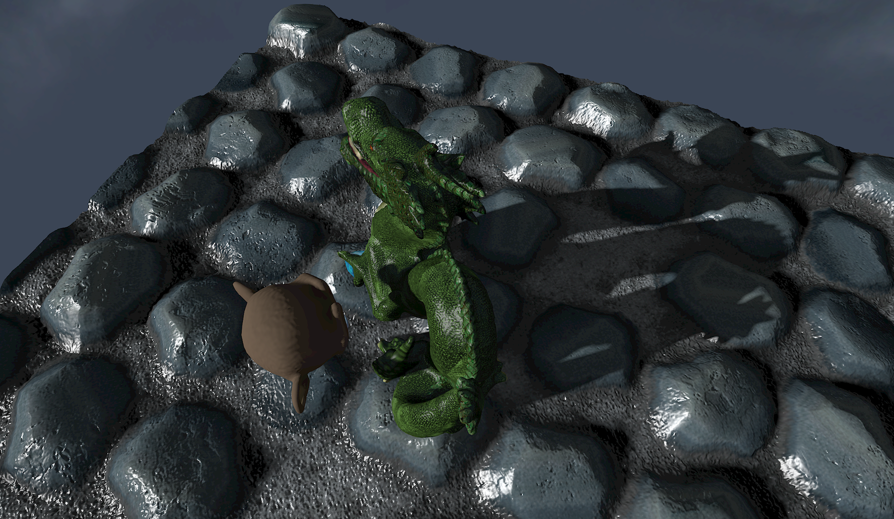
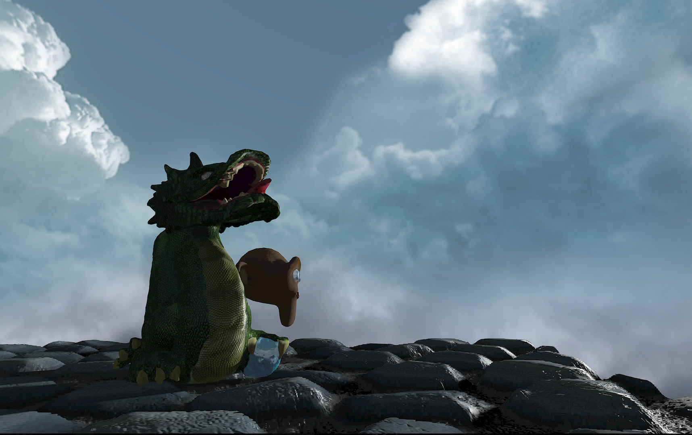

# OpenGL version

The OpenGL version is the initial reference version. It is based on the OpenGL 3 features set, with the programmable pipeline, and use glfw3 for accessing the windowing system, user inputs,... It should be compatible with macOS, Windows and Ubuntu.

The following features are implemented:

- meshes and textures loading
- Phong shading/ per-pixel lighting
- Normal and specular mapping
- Skybox
- Environment cubemap for reflections
- Keyboard-controlled camera
- Variance shadow mapping
- Parallax mapping
- FXAA anti-aliasing
- Custom internal rendering resolution

The program was part of a more general tutorial project, `GL_Template` which has since evolved and been replaced by [Rendu](https://github.com/kosua20/Rendu).

