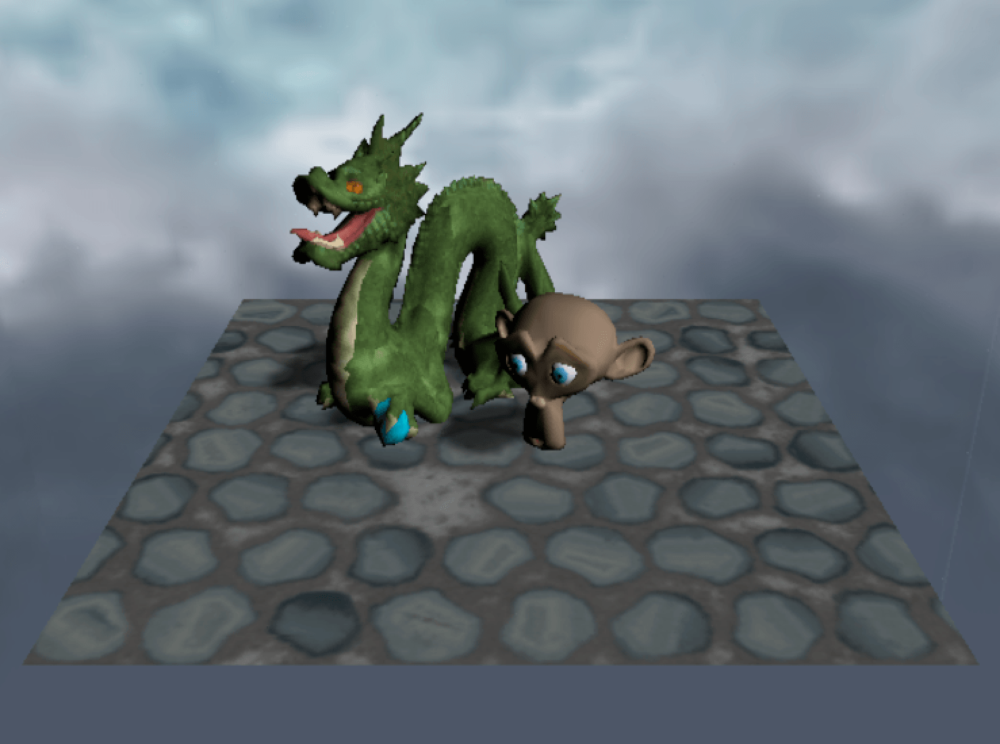
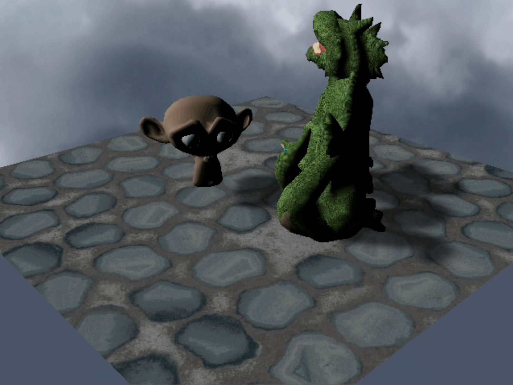
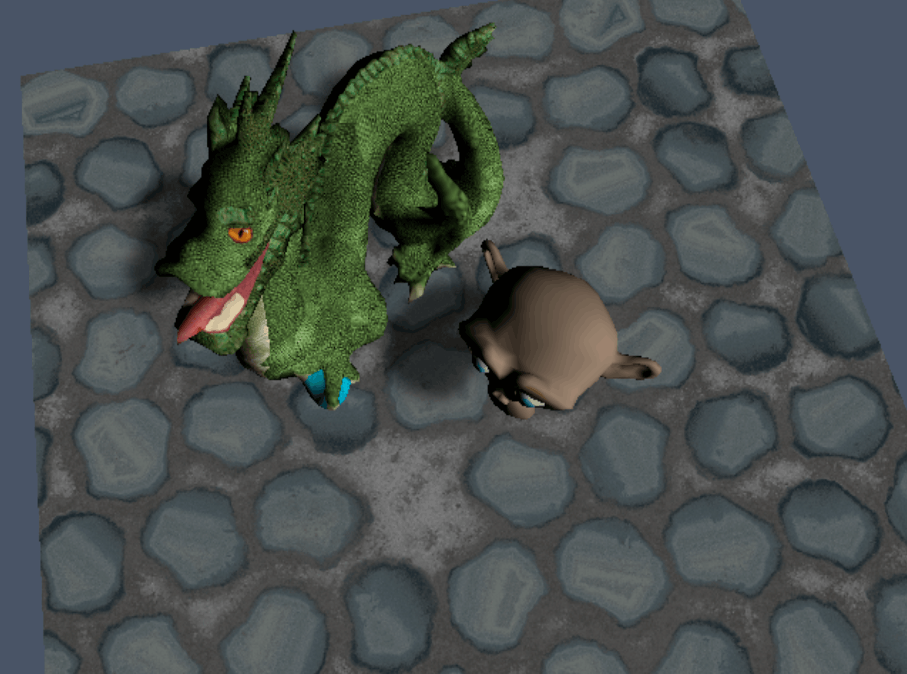
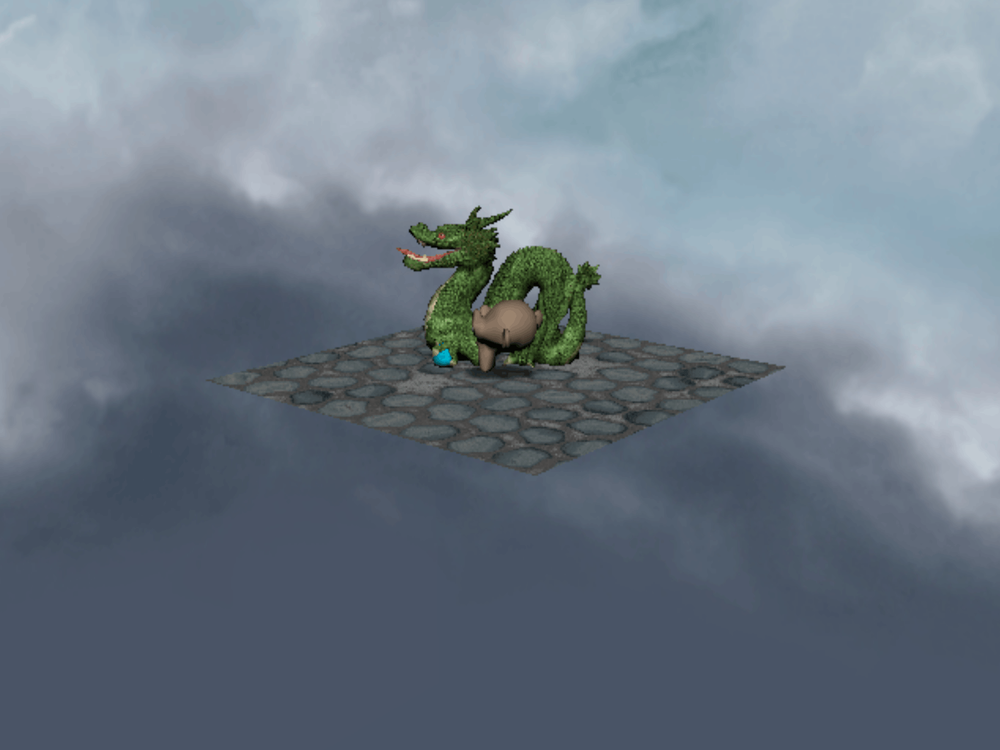

## PS2 version

This version was implemented using the [ps2dev SDK](https://github.com/ps2dev/ps2sdk), and tested in PCSX2 under Ubuntu. The camera can be moved with the 4-directional pad to rotate and the cross and triangle buttons to get closer/farther from the scene. The demo use a double-buffered setup, running at 30 or 60 FPS depending on the performances. This uses a big chunck of the 4MB VRAM, leaving just enough room for a 256x256 texture, in which we swap the texture for the current model at each frame. Bilinear filtering is used but tends to blur the textures.

The structure of the PS2 is peculiar, with specialized sub-processors. From a graphics pipeline point of view, the PS2 only provide a rasterizer. Model transformations, shading, projection on the screen, clipping and culling, conversion to pixel units, have to be done by the programmer on the main CPU (EE) or the vector processing units (VU0 & VU1) with inline assembly. The SDK provides a series of helpers, but I overloaded some to fit my needs.

Shadows are baked into the texture map of the floor (well, hand-drawn to be honest...), as setting up shadow maps or shadow volumes would require a huge amount of work for such a small project.

I also haven't implemented a fine clipping. As soon as a triangle has a point outside the frustum, it is completely discarded. I simply rely on meshes having a high density of triangles and the PS2 having a safety margin around the visible screen to avoid any on-screen clipped triangle. This works quite well in practice, as the PS2 Graphics synthesizer can process a great amount of geometry.
