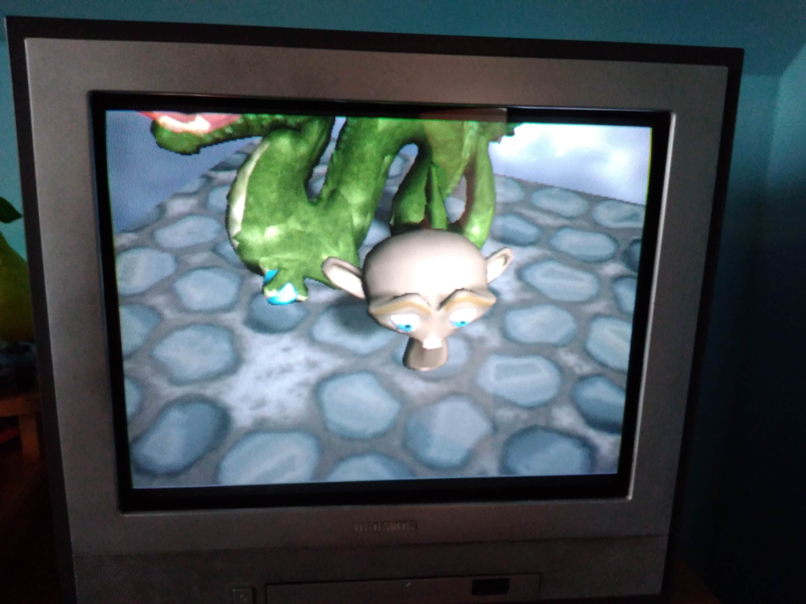
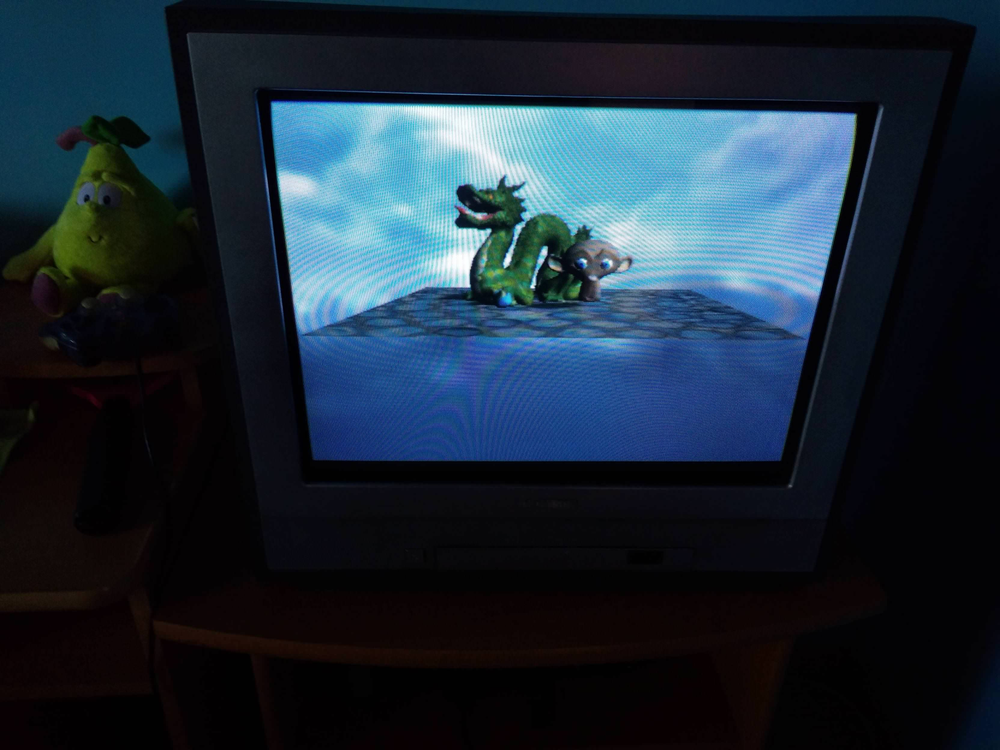
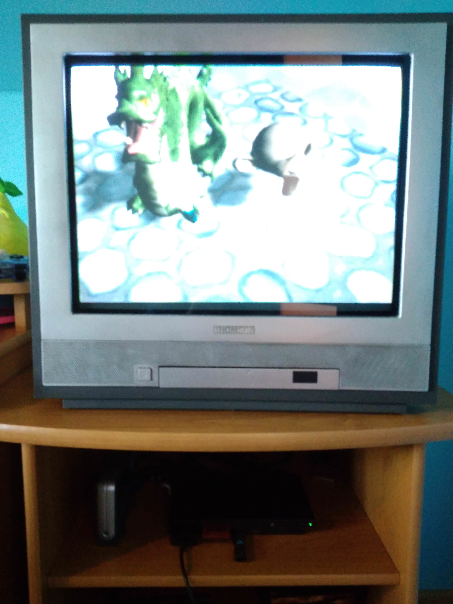

## PS2 version

This version was implemented using the [ps2dev SDK](https://github.com/ps2dev/ps2sdk), and tested in PCSX2. The camera can be moved with the 4-directional pad to rotate and the cross and triangle buttons to get closer/farther from the scene. The demo use a double-buffered setup, running at 25 or 50 FPS depending on the performances. 

The structure of the PS2 is peculiar, with two sub-processors dedicated to vertex processing. The console provides a fixed-pipeline rasterizer with perspective correct interpolation and texture mapping, but vertex transformation and shading, clipping and culling, conversion to viewport units, have to be done by the programmer on either the main CPU (EE) or the vector processing units (VU0 & VU1). The latest option is the most performant, but requires writing small assembly programs executed on the unit for vertex processing. Due to strong memory limitations on both the graphics and vector unit memory, vertices and textures have to be transferred at each draw.

Shadows are baked into the texture map of the floor (well, hand-drawn to be honest...), but using some approximation of shadow volumes could be an option.
Textures are paletized on 8 bits to maximize memory use.

There is no clipped triangles generation: as soon as a triangle has a vertex outside the frustum, it is completely discarded. I simply rely on meshes having a high density of triangles and the PS2 having a safety margin around the visible screen to avoid any on-screen clipped triangle. This works quite well in practice, as the PS2 Graphics synthesizer can process a large amount of geometry.

The compiled executable of an earlier non-VU1 version could be run on real hardware, as confirmed by DoMiNeLa10 on a PS2 Slim PAL using uLaunchELF. Credit for the three images below goes to DoMiNeLa10, thank you again!

