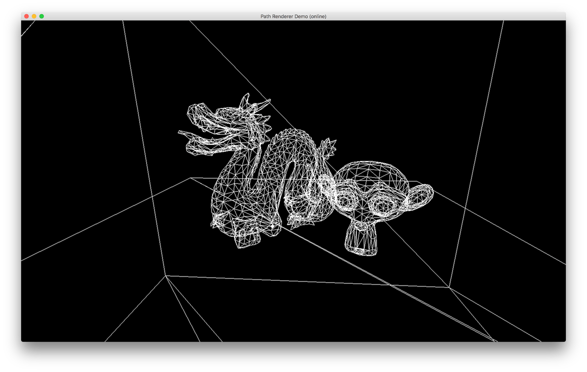
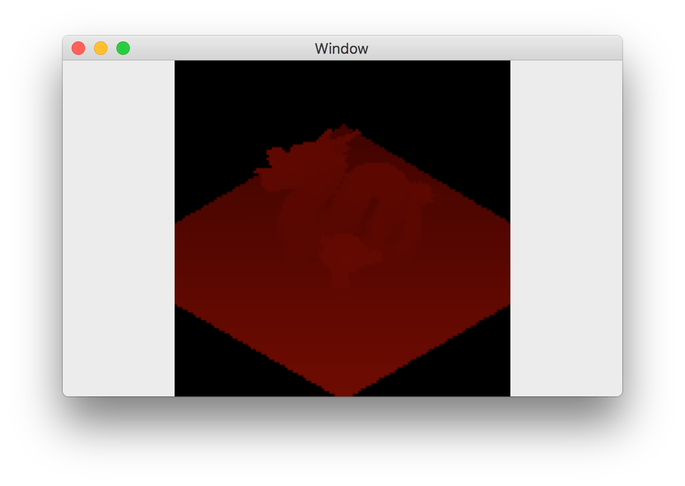
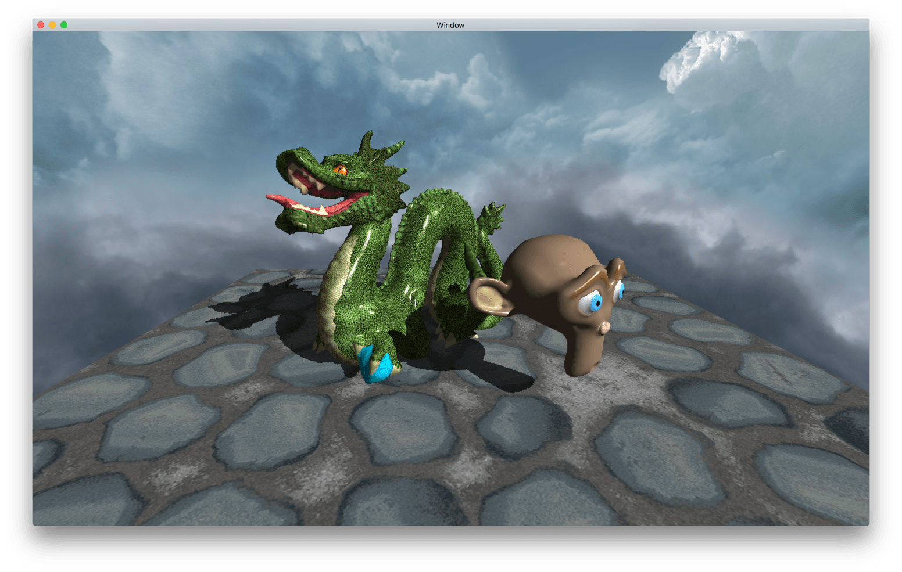

## Software renderer version - Ptah

This version uses a custom software renderer that performs transformations, rasterization and shading on the CPU. More details can be find in this [blog post](http://blog.simonrodriguez.fr/articles/18-02-2017_writing_a_small_software_renderer.html) where a simplified version of the renderer is described. The full code is available in the sub-repository.

Results rendered offline at a high resolution with bilinear texture filtering, high-quality shadows, Phong lighting,... Issues with texture seams can be noticed in the background.

Wireframe rendering is also supported.

Multiple framebuffers can be used, for instance to perform shadow mapping.

Another result with nearest-neighbour texture look-ups.

