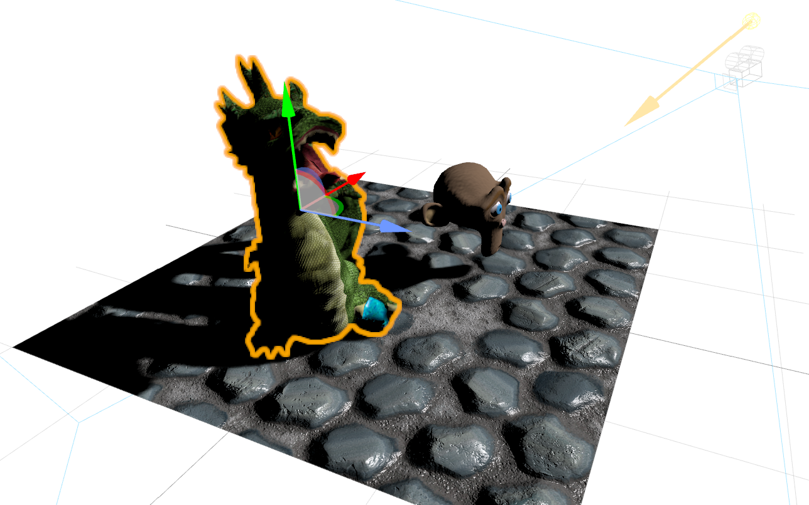
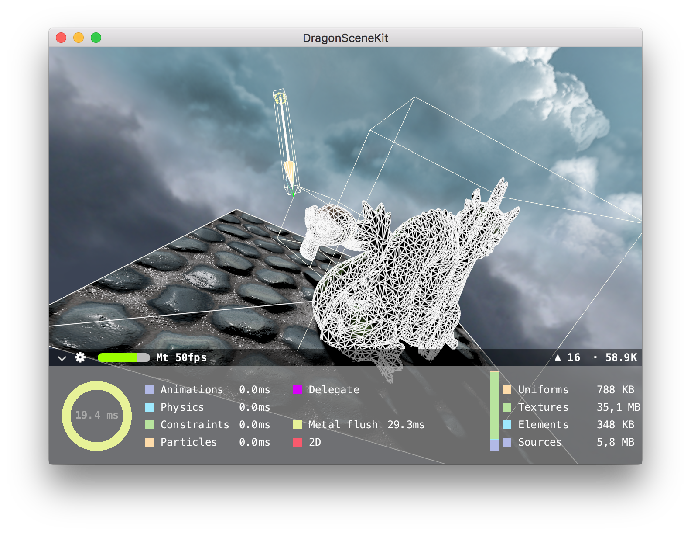

## SceneKit version

SceneKit is a high-level real-time 3D framework developed by Apple and available on macOS, iOS and tvOS. It allows for the development of games and 3D applications with a limited/no amount of custom rendering code. It provides lighting shaders, shadow maps, environment cubemap, etc.

The whole scene, including models, texturing infos and animations is stored in a .scn file that can be visually edited in Xcode. The data is stored in a .scnassets directory, converted and compressed at build time for efficiency.

The same scene can be used on all three platforms in the same project if the performances allow it. SceneKit is backed by Metal or OpenGL depending on the device and its capacities.

*In the SceneKit editor.*

*With the debug overlay enabled.*

