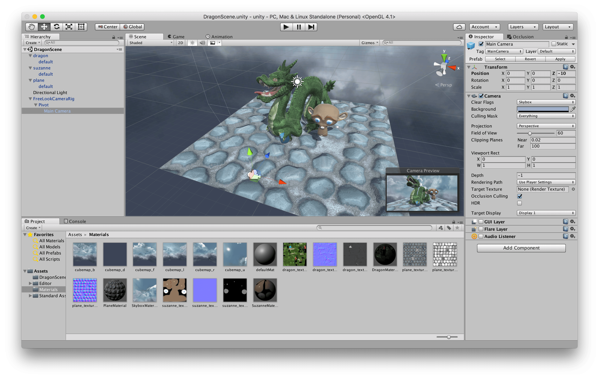

## Unity version

The Unity version was entirely created inside Unity itself (the 2022 LTS version), for assets placement, materials configuration, lighting and animations,... The only code required was for the camera: Unity provides a script to handle a camera rotating around a pivot, with minor tweaks.

This uses the recent high quality rendering pipeline (HDRP) with PBR materials, so the additional effects maps for each object have been adjusted to provide the required physical parameters. Also, Unity provides a parallax mapping effect, here applied on the ground material. A reflection probe is placed in the level and updated at launch, along with baked light probes.

*In the Unity editor.*

*Another view.*

