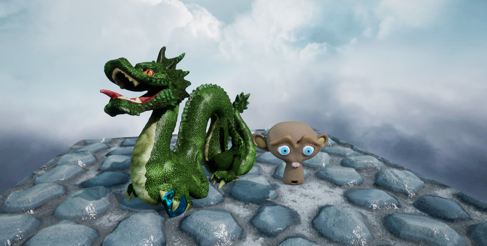
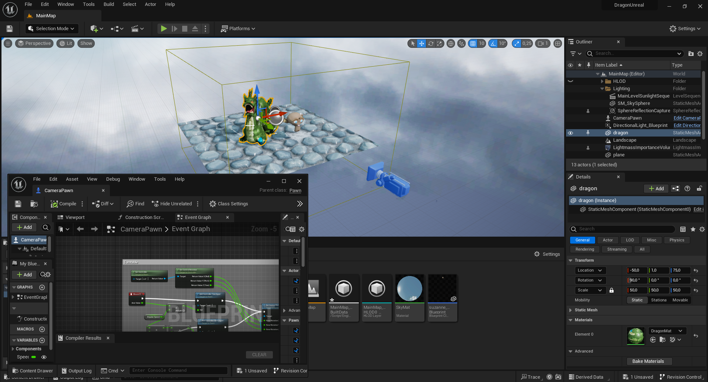
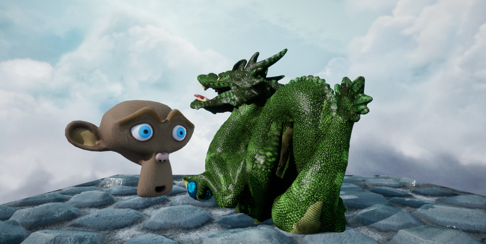
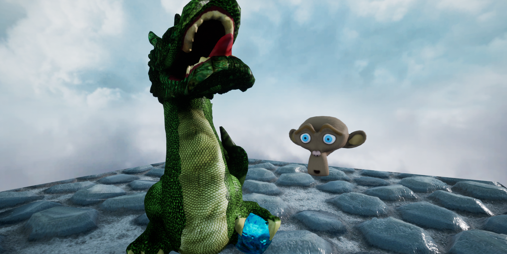

## Unreal version

The Unreal version has been created in the current 5.2 version of the editor. Everything has been setup through placement and node-based blueprints: materials configuration, sky appearance and lighting, animations of lights and meshes,... A simple turntable camera has been implemented, attached to a pawn at the center of the scene. 

PBR materials are in-use, so the additional effects maps for each object have been adjusted to provide the required physical parameters (similar to Unity). A parallax mapping effect is enabled on the ground material. A baked reflection probe and a lightmass volume are placed in the level for global illumination. Lumen has intentionnally been disabled to stay closer to other samples, the effect being minute on such a toy scene.

*In the Unreal editor.*

*Other views.*

