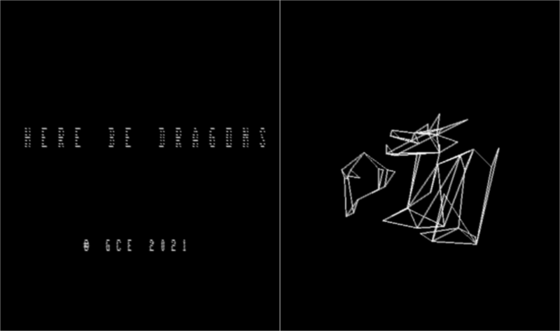
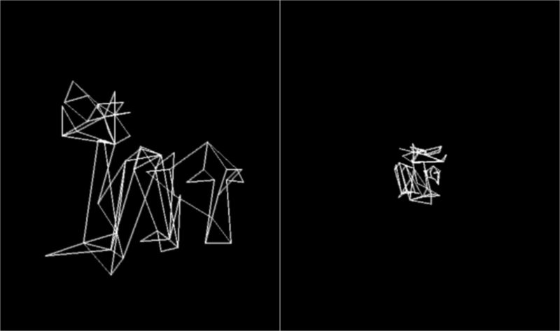
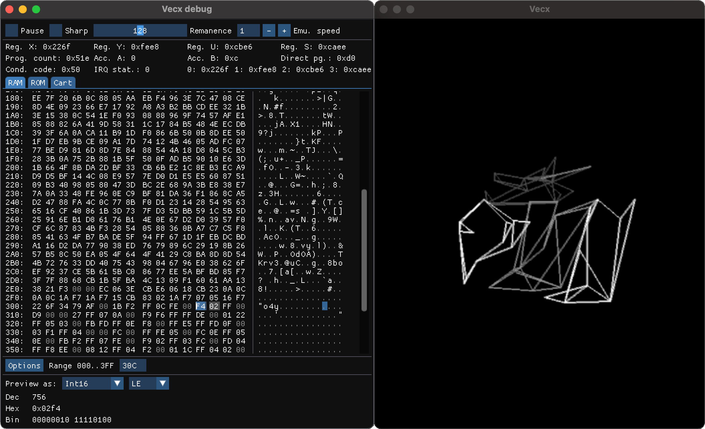

## Vectrex version

This version is targeting the Vectrex console and its vector-based display. This relies on the [CMOC toolchain](http://perso.b2b2c.ca/~sarrazip/dev/cmoc.html) for compilation (setup detailed [here](https://vandenbran.de/post/2016-02-01-a-modern-toolchain-for-vectrex-development/)) and was tested in a fork of the [Vecx emulator](http://www.valavan.net/vectrex.html). For more technical details see this [write-up](http://blog.simonrodriguez.fr/articles/15-05-2021_3d_rendering_on_the_vectrex.html) on my blog.

Both object geometries were heavily simplified and split into parts, and their screen space positions precomputed and stored in the cartrige to save performances. There is not depth testing and everything is rendered in wireframe. The camera can rotate around the scene and zoom in/out using the joystick. Speed can be adjusted with the controller buttons. An optional overlay can be used to add a bit of color.

