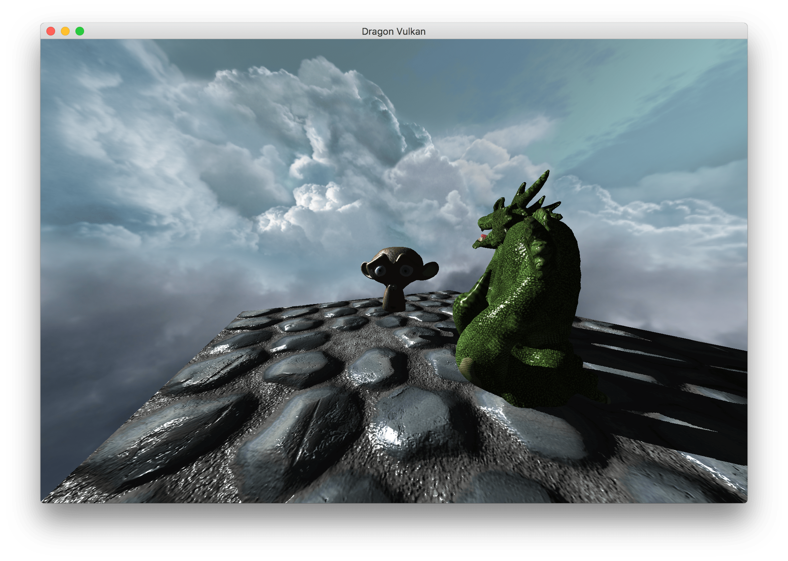

## Vulkan version

Vulkan is the latest low-level graphics standard API introduced by the Khronos group. It provides a finer grained control of the GPU driver and hardware compared to older APIs such as OpenGL. It relies on the generation (in real-time or in advance) of command buffers submitted to processing queues, and introduces a more declarative way of working with attributes, uniforms and pipelines through descriptors. Double buffering, presentation on screen and rendering operations synchronization has to be handled by the application. 

Shaders can be written in a specific version of GLSL and precompiled to an intermediate representation, SPIR-V.
To compile and run this sample, you will have to install the LunarG [Vulkan SDK](https://vulkan.lunarg.com) and udpate the include/library paths in the project corresponding to your platform.

