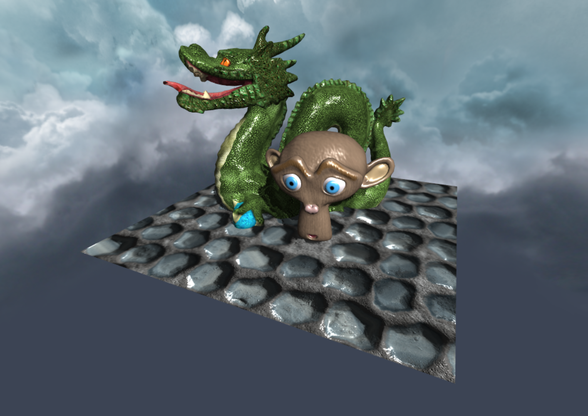

##WebGL version

This is the WebGL 1 version, viewable [here](http://simonrodriguez.fr/dragon/webgl/index.html)

glMatrix.js is used for vectors and matrices computations, and webgl-obj-loader.js for 0BJ loading.
For simplicity, the vertices data is completely included in the index.html file.
The textures resolution has been divided by 2, specular/shininess maps and reflection mapping are also not used, replaced by constant values.

The shadows are computed using the Variance shadow mapping technique, giving smoother results than a simple shadow map.

No interaction in this one for now (TODO: implement a trackball in Javascript).

