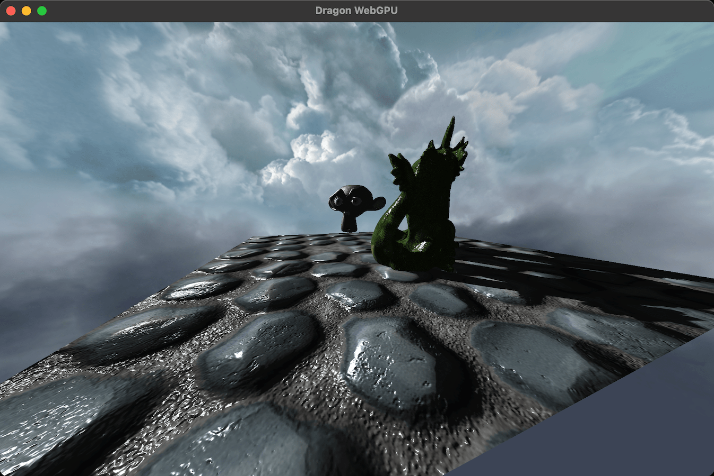

## WebGPU version

WebGPU is a recent low-level graphics standard API for browsers, available in Javascript but also in standalone apps via a C interface. It provides a finer grained control of the GPU driver and hardware compared to WebGL, with structures and abstractions inspired from Vulkan, Metal and DX12. It relies on the recording of draws and disptaches in render passes and command buffers, which are then submitted to a queue for deferred execution. It introduces a more declarative way of working with resources, shader attributes and pipelines through state objects and bind groups. Swapchain, resource allocations and synchronization are handled by the backend, making it simpler to handle than its desktop counterparts.

Shaders can be written in a custom shader language, WGSL and compiled on-the-fly by the driver, when creating large pipeline state objects.

This sample is in C++ and relies on the [Dawn backend](https://dawn.googlesource.com/dawn/+/refs/heads/chromium-gpu-experimental/README.md) from Google for its WebGPU implementation, which is cloned and built along the application. The [Learn WebGPU for native graphics in C++](https://eliemichel.github.io/LearnWebGPU/index.html) tutorial has been incredibly helpful for setting up this port. 

